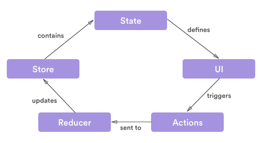

## HiOS Music Player
*HTML5 & LESS & pure Javascript, styled off iOS 10 music and redux design patterns*

**Scripts**
- `$ gulp js` build js files 
- `$ gulp less` run less compiler on all less files
- `$ npm run dev`  and  `$ npm run serve` start development server at 127.0.0.1:8000

fonts & animation: icomoon, css-animate, noun project (credit in filename)

-----------------------------------------------------
### Notes On Learning Redux
*Sources: [egghead.io](https://egghead.io/courses/getting-started-with-redux) , [redux.js.org](redux.js.org), otherwise noted in-line*

#### Purpose of Redux
1.  Keep track of the current state of an application in a single JS object. 
2.  All mutations to the state tree are explicit. Changes to the state are initiated (and will only ever occur) after an *action* is dispatched.  The change to the state, as described through the action, has a type, usually a string such as 'ADD_TODO'.  It may also pass other additional data.  
3.   State mutations in a redux app always occur through a pure function.  This function should take in the previous state & dispatched action and return the new state.  The *reducer*, basically a switch/case statement, is where the logic for executing state mutations are held.



#### Vanilla Implementation

SAMPLE REDUCER
The purpose of a reducer is to hold the logic for state mutations

```javascript
const counterReducer = (state = 0, action) => {
  switch (action.type) {
    CASE 'INCREMENT':
      return state + 1;
    CASE 'DECREMENT':
      return state - 1
    default: 
      return state;  
  }
}
```

SAMPLE STORE 
The purpose of the store is to hold the state tree object

- store.getState() retrieves current state
- store.dispatch( {type: 'INCREMENT'} ) dispatches an action
- store.subscribe() follows everytime store changes so that you can update UI and do whatever else
```javascript
const createStore = (reducer) => {
  let state;
  let listeners = [] //because the subscribe function can be called many times we need to keep track of the change listeners
  
  const getState = () => state;
  
  const dispatch = (action ( => {
    state = reducer(state, action);
    listeners.forEach( listener => listener() 
    ); //notify each listener after there's a new state from reducer
  }
  
  const subscribe = (listener) => {
    listeners.push(listener);
    return () => {
      listeners = listeners.filter( l => l !== listener )//to remove listener subscribe again
    }
  };
  
  dispatch({}) //for intial state to be rendered when store created
  
  return { getState, dispatch, subscribe };
}
```
*WATCH OUT / WARNINGS*
- When reducers operate on properties of the state tree that are arrays -- use .concat (instead of .push), .slice (instead of .splice) to keep function pure and non-mutating
- When reducers operate on properties of the state tree that are objects -- use Object.assign from ES6 (instead of reassigning values with = something or = !something)


#### Potential Utils 
Make store changes observable - since we shouldn't [subscribe directly](https://github.com/reactjs/redux/issues/303#issuecomment-125184409)
```javascript
function observeStore(store, select, onChange) {
  let currentState;

  function handleChange() {
    let nextState = select(store.getState());
    if (nextState !== currentState) {
      currentState = nextState;
      onChange(currentState);
    }
  }

  let unsubscribe = store.subscribe(handleChange);
  handleChange();
  return unsubscribe;
}

```

Combine multiple reducers into a single function then send into store
```javascript
const combineReducers = (reducers) => { // takes in reducer functions
  return (state = {}, action) => { // returns a new function representing all reducers logic combined
    return Object.keys(reducers).reduce(
      (nextState, key) => { // nextState is function holding reducer, key is the reducer function
        nextState[key] = reducers[key]( // goes into each reducer function
          state[key], 
          action
        );
      return nextState;
      }
      {}
    );
  };
}; 

const combinedReducer = combineReducers({
    a : sliceReducerA,
    b : sliceReducerB
}); 
```

Handle special cross-slice cases in reducers, such as those where additional data is passed beyond previous state and action
```javascript
function crossSliceReducer(state, action) {
    switch(action.type) {
        case "SOME_SPECIAL_ACTION" : {
            return {
                // specifically pass state.b as an additional argument
                a : handleSpecialCaseForA(state.a, action, state.b),
                b : sliceReducerB(state.b, action)
            }        
        }
        default : return state;
    }
}
```
